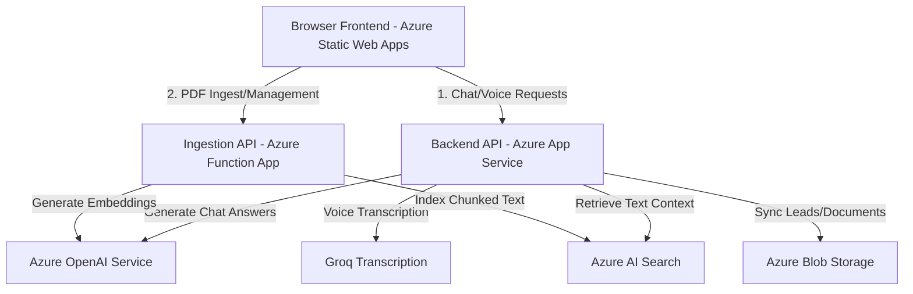

# Azure Deployment Guide

This guide describes how to deploy the **Desire ChatBot (Visit-to-Lead)** project to Microsoft Azure. 

The application architecture is structured into three deployable components:
1. **Frontend**: React (Vite) application hosted on **Azure Static Web Apps** (cost-effective, CDN edge-cached, simple SSL).
2. **Backend**: FastAPI Python application hosted on **Azure App Service (Linux Web App)**.
3. **Ingestion & Indexing Service**: Python Azure Functions hosted on **Azure Function App** to upload, chunk, embed, and index PDF files into Azure AI Search.

---

## Architecture Overview



---

## 1. Prerequisites

Before you start, ensure you have:
1. An active **Microsoft Azure Account** with subscription privileges.
2. **Azure CLI** installed. [Install Azure CLI](https://learn.microsoft.com/cli/azure/install-azure-cli).
3. **Node.js 18+** and **npm** installed (for frontend builds).
4. **Python 3.11** installed.
5. **Azure Functions Core Tools v4** installed (for publishing the Function App). [Install Core Tools](https://learn.microsoft.com/azure/azure-functions/functions-run-local).
6. A GitHub Repository containing the codebase (highly recommended for CI/CD setup).

---

## 2. Step-by-Step Azure Resource Provisioning

### 2.1 Authenticate with Azure CLI
Open PowerShell or your preferred terminal and log in to your Azure account:
```powershell
# Log in to Azure
az login

# List subscriptions and verify your active subscription
az account list --output table

# Set the target subscription if you have multiple
az account set --subscription "Your-Subscription-Name-or-ID"
```

### 2.2 Create a Resource Group
Create a resource group to contain all chatbot resources:
```powershell
az group create --name rg-desire-chatbot --location eastus
```

---

## 3. Deploying the Backend API (Azure App Service)

The backend is a FastAPI Python application (`visit-to-lead/backend`). We will host it on an App Service Linux plan running Python 3.11.

### 3.1 Create App Service Plan
Create a Linux App Service plan. The `B1` (Basic) plan is cost-effective and sufficient for development/production.
```powershell
az appservice plan create \
  --name plan-desire-chatbot-backend \
  --resource-group rg-desire-chatbot \
  --sku B1 \
  --is-linux \
  --location eastus
```

### 3.2 Create Web App Instance
Create the web app with the Python 3.11 runtime:
```powershell
az webapp create \
  --name app-desire-chatbot-backend \
  --resource-group rg-desire-chatbot \
  --plan plan-desire-chatbot-backend \
  --runtime "PYTHON:3.11"
```
*(Note: Choose a unique name for `--name`. The domain will be `https://<webapp-name>.azurewebsites.net`)*

### 3.3 Configure the FastAPI Startup Command
FastAPI requires Uvicorn to run. Configure Azure App Service to run the app using the Gunicorn Uvicorn worker (recommended for production performance):
```powershell
az webapp config set \
  --name app-desire-chatbot-backend \
  --resource-group rg-desire-chatbot \
  --startup-file "gunicorn -w 4 -k uvicorn.workers.UvicornWorker main:app"
```
*(Alternatively, you can use: `uvicorn main:app --host 0.0.0.0 --port 8000`)*

### 3.4 Set Environment Variables
Configure the application settings with the values from your `backend/.env` file. Do not wrap values in double quotes when using Azure CLI:
```powershell
az webapp config appsettings set \
  --name app-desire-chatbot-backend \
  --resource-group rg-desire-chatbot \
  --settings \
    AZURE_OPENAI_ENDPOINT="https://your-resource.cognitiveservices.azure.com/" \
    AZURE_OPENAI_API_KEY="your_azure_openai_api_key_here" \
    AZURE_OPENAI_API_VERSION="2024-12-01-preview" \
    AZURE_OPENAI_CHAT_DEPLOYMENT="gpt-4o" \
    AZURE_OPENAI_EMBEDDING_DEPLOYMENT="text-embedding-3-small" \
    AZURE_OPENAI_TEMPERATURE="0.1" \
    LLM_MAX_OUTPUT_TOKENS="1200" \
    AZURE_OPENAI_MAX_COMPLETION_TOKENS="16384" \
    AZURE_SEARCH_ENDPOINT="https://your-search-service.search.windows.net" \
    AZURE_SEARCH_INDEX_NAME="chatbot-rag" \
    AZURE_SEARCH_API_KEY="your_azure_search_api_key" \
    AZURE_SEARCH_ID_FIELD="id" \
    AZURE_SEARCH_CONTENT_FIELD="content" \
    AZURE_SEARCH_VECTOR_FIELD="contentVector" \
    AZURE_SEARCH_TOP_K="5" \
    AZURE_SEARCH_SCORE_THRESHOLD="0.2" \
    GROQ_API_KEY="your_groq_api_key_here" \
    GROQ_TRANSCRIPTION_MODEL="whisper-large-v3" \
    EDGE_TTS_VOICE="en-US-AriaNeural" \
    CHAT_TRACE_ENABLED="true" \
    CHAT_TRACE_PRINT_CONSOLE="true" \
    CHAT_TRACE_INCLUDE_CONTEXT="true" \
    CHAT_TRACE_LOG_PATH="logs/chat_trace.jsonl" \
    CHAT_PROCESS_LOG_PATH="logs/chat_process_last10.json" \
    CHAT_PROCESS_LOG_LIMIT="10"
```

### 3.5 Prepare and Deploy the Code (Zip Deploy)
To deploy the code, package the `backend` directory into a `.zip` file (excluding local environments like `venv`, log files, and `__pycache__` to keep the file size small).

**In Windows (PowerShell):**
```powershell
# Navigate to the backend directory
cd visit-to-lead/backend

# Create a zip archive (excluding venv, logs, pycache)
Compress-Archive -Path * -DestinationPath backend.zip -Exclude @("venv", "logs", "__pycache__", "backend.zip", ".env") -Force

# Deploy the zip archive directly to Azure
az webapp deployment source config-zip \
  --name app-desire-chatbot-backend \
  --resource-group rg-desire-chatbot \
  --src backend.zip
```

---

## 4. Deploying the Ingestion Service (Azure Function App)

The ingestion service (`visit-to-lead/azure_functions`) runs on Azure Functions and processes PDF file uploads, chunking the content, embedding it, and indexing it inside Azure AI Search.

### 4.1 Create Storage Account
Azure Function App requires a general-purpose Storage Account to store internal function logs and manage state:
```powershell
az storage account create \
  --name stdesirechatbotingest \
  --resource-group rg-desire-chatbot \
  --location eastus \
  --sku Standard_LRS
```
*(Note: Storage account name must be globally unique, 3-24 characters, numbers and lowercase letters only).*

### 4.2 Create Azure Function App
Create the Function App with Python 3.11 runtime on a consumption (pay-as-you-go) Linux hosting plan:
```powershell
az functionapp create \
  --name func-desire-chatbot-ingestion \
  --resource-group rg-desire-chatbot \
  --consumption-plan-location eastus \
  --runtime python \
  --runtime-version 3.11 \
  --functions-version 4 \
  --storage-account stdesirechatbotingest \
  --os-type Linux
```

### 4.3 Configure Function App Environment Settings
Configure the required connection strings and service endpoints in the Function App settings:
```powershell
az functionapp config appsettings set \
  --name func-desire-chatbot-ingestion \
  --resource-group rg-desire-chatbot \
  --settings \
    AZURE_OPENAI_ENDPOINT="https://your-resource.cognitiveservices.azure.com/" \
    AZURE_OPENAI_API_KEY="your_azure_openai_api_key_here" \
    AZURE_OPENAI_API_VERSION="2024-12-01-preview" \
    AZURE_OPENAI_EMBEDDING_DEPLOYMENT="text-embedding-3-small" \
    AZURE_SEARCH_ENDPOINT="https://your-search-service.search.windows.net" \
    AZURE_SEARCH_INDEX_NAME="chatbot-rag" \
    AZURE_SEARCH_API_KEY="your_azure_search_api_key" \
    AZURE_SEARCH_ID_FIELD="id" \
    AZURE_SEARCH_CONTENT_FIELD="content" \
    AZURE_SEARCH_VECTOR_FIELD="contentVector" \
    ALLOWED_ORIGIN="*"
```

### 4.4 Deploy the Functions Code
Use the Azure Functions Core Tools CLI to publish the function app:
```powershell
# Navigate to the azure_functions directory
cd ../azure_functions

# Publish to your Azure Function App
func azure functionapp publish func-desire-chatbot-ingestion
```
Once deployed, the terminal will print the HTTP trigger endpoints (e.g. `https://func-desire-chatbot-ingestion.azurewebsites.net/api/files`).

---

## 5. Deploying the Frontend (Azure Static Web Apps)

The frontend is a React application built with Vite (`visit-to-lead/frontend`). Since it compiles down to static HTML, JS, and CSS, deploying it to **Azure Static Web Apps** is the modern best practice on Azure.

### 5.1 Clean and Build the React Application Locally (Optional Validation)
Ensure the frontend builds without errors:
```powershell
# Navigate to the frontend directory
cd ../frontend

# Install dependencies
npm install

# Build the project
npm run build
```
Verify that the `dist/` folder was successfully created.

### 5.2 Deploy via Azure Static Web Apps CLI (SWA CLI)
Using the SWA CLI is the fastest way to deploy static files directly from your command line without setting up a Git repository workflow.

1. **Install the SWA CLI globally**:
   ```powershell
   npm install -g @azure/static-web-apps-cli
   ```
2. **Deploy the frontend**:
   Run the deploy command. SWA CLI will prompt you to log in to Azure if you haven't already:
   ```powershell
   swa deploy ./dist \
     --env production \
     --app-name swa-desire-chatbot-frontend \
     --resource-group rg-desire-chatbot \
     --location eastus2
   ```
   *(Note: Static Web Apps are hosted globally, but configuration metadata is created in selected regions like `eastus2`, `centralus`, `westus2`, etc.)*

### 5.3 Configure Frontend Environment Variables in SWA
Static Web Apps serve static files, so environment variables starting with `VITE_` must be available during the **build** process or served as environment overrides.
In SWA, go to the Portal -> Configuration, and set:
- `VITE_API_BASE_URL`: Set this to your backend API URL (e.g. `https://app-desire-chatbot-backend.azurewebsites.net`).
- `VITE_FLOATING_BOT_IMAGE_URL`: `/bot.gif`

If you are using GitHub Actions (recommended production method), you can pass this environment variable during the workflow build step:
```yaml
- name: Build And Deploy
  uses: Azure/static-web-apps-deploy@v1
  with:
    azure_static_web_apps_api_token: ${{ secrets.AZURE_STATIC_WEB_APPS_API_TOKEN }}
    repo_token: ${{ secrets.GITHUB_TOKEN }}
    action: "upload"
    app_location: "visit-to-lead/frontend"
    output_location: "dist"
  env:
    VITE_API_BASE_URL: "https://app-desire-chatbot-backend.azurewebsites.net"
```

---

## 6. CORS and Security Configuration

To ensure your frontend and backend communicate securely, you should tighten cross-origin constraints.

### 6.1 Update Backend CORS Configuration (Optional)
Currently, `backend/main.py` is configured with `allow_origins=["*"]` (permissive). For production, update it to only allow requests from your deployed frontend Static Web App domain.

1. Get the URL of your Static Web App:
   ```powershell
   az staticwebapp show --name swa-desire-chatbot-frontend --query "defaultHostname" --output tsv
   ```
   *(e.g. `https://gray-sea-01a2b3c4.azurestaticapps.net`)*
2. In `backend/main.py`, update `CORSMiddleware` configuration to specify your frontend URL:
   ```python
   app.add_middleware(
       CORSMiddleware,
       allow_origins=["https://gray-sea-01a2b3c4.azurestaticapps.net"],
       allow_credentials=True,
       allow_methods=["*"],
       allow_headers=["*"],
       # ... expose headers
   )
   ```
3. Re-deploy the backend code using `az webapp deployment source config-zip`.

### 6.2 Update Ingestion Function CORS (Allowed Origins)
Update the Function App environment settings so it only accepts PDF uploads from your frontend domain or the File Manager UI:
```powershell
az functionapp config appsettings set \
  --name func-desire-chatbot-ingestion \
  --resource-group rg-desire-chatbot \
  --settings \
    ALLOWED_ORIGIN="https://gray-sea-01a2b3c4.azurestaticapps.net"
```

---

## 7. Verification and Testing

### 7.1 Verify Backend Health
Navigate to:
`https://app-desire-chatbot-backend.azurewebsites.net/health`
It should return a successful JSON status response.

### 7.2 Configure PDF File Manager UI
To use `azure_ai_search_file_manager.html` in production:
1. Open the local `azure_ai_search_file_manager.html` file in a browser.
2. In the **Azure Function Base URL** field, enter your deployed Function App URL:
   `https://func-desire-chatbot-ingestion.azurewebsites.net/api`
3. Click **Save URL**.
4. Test by uploading a PDF file. Verify that it appears in the listed files and chunks are successfully pushed to Azure AI Search.

### 7.3 Test the End-to-End Chat
1. Open the frontend URL (`https://<your-swa-name>.azurestaticapps.net`).
2. Complete the lead capture step (enter email and name).
3. Type a query (e.g. "What type of services does Desire Infoweb provide?").
4. Verify that the answer streams in successfully with appropriate citations/references.
