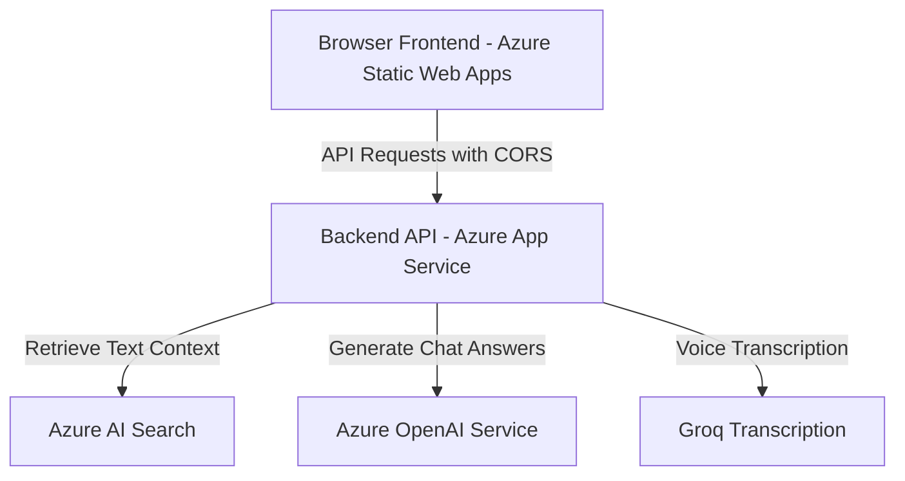

# Separate Azure Deployment Guide (Frontend & Backend)

This guide describes how to deploy the **React Frontend** and the **FastAPI Backend** as separate services on Microsoft Azure:
1. **Frontend**: React (Vite) application hosted on **Azure Static Web Apps (SWA)**.
2. **Backend**: FastAPI Python application hosted on **Azure App Service (Linux Web App)**.

*Note: The Ingestion API is handled directly by the FastAPI backend (`/api/ingest/upload`), so deploying the separate Azure Function App is completely optional.*

---

## Deployment Architecture



---

## 1. Prerequisites
Ensure you have installed:
* **Azure CLI**: [Install Azure CLI](https://learn.microsoft.com/cli/azure/install-azure-cli)
* **Node.js 18+ and npm**
* **Python 3.11**

---

## 2. Step 1: Provision the Azure Backend (FastAPI)

### 2.1 Login and Create Resource Group
```powershell
az login
az group create --name rg-desire-chatbot --location eastus
```

### 2.2 Create App Service Plan & Web App
```powershell
# Create Linux Plan
az appservice plan create \
  --name plan-desire-chatbot-backend \
  --resource-group rg-desire-chatbot \
  --sku B1 \
  --is-linux \
  --location eastus

# Create Web App
az webapp create \
  --name app-desire-chatbot-backend \
  --resource-group rg-desire-chatbot \
  --plan plan-desire-chatbot-backend \
  --runtime "PYTHON:3.11"
```
*(Choose a globally unique name for `--name`. Your backend URL will be `https://<your-backend-name>.azurewebsites.net`)*

### 2.3 Set Backend Environment Variables
Configure the application settings with the values from your `backend/.env` file. Do not wrap values in double quotes:
```powershell
az webapp config appsettings set \
  --name app-desire-chatbot-backend \
  --resource-group rg-desire-chatbot \
  --settings \
    AZURE_OPENAI_ENDPOINT="https://your-resource.cognitiveservices.azure.com/" \
    AZURE_OPENAI_API_KEY="your_azure_openai_api_key_here" \
    AZURE_OPENAI_API_VERSION="2024-12-01-preview" \
    AZURE_OPENAI_CHAT_DEPLOYMENT="gpt-4o" \
    AZURE_OPENAI_EMBEDDING_DEPLOYMENT="text-embedding-3-small" \
    AZURE_OPENAI_TEMPERATURE="0.1" \
    LLM_MAX_OUTPUT_TOKENS="1200" \
    AZURE_OPENAI_MAX_COMPLETION_TOKENS="16384" \
    AZURE_SEARCH_ENDPOINT="https://your-search-service.search.windows.net" \
    AZURE_SEARCH_INDEX_NAME="chatbot-rag" \
    AZURE_SEARCH_API_KEY="your_azure_search_api_key" \
    AZURE_SEARCH_ID_FIELD="id" \
    AZURE_SEARCH_CONTENT_FIELD="content" \
    AZURE_SEARCH_VECTOR_FIELD="contentVector" \
    AZURE_SEARCH_TOP_K="5" \
    AZURE_SEARCH_SCORE_THRESHOLD="0.2" \
    GROQ_API_KEY="your_groq_api_key_here" \
    GROQ_TRANSCRIPTION_MODEL="whisper-large-v3" \
    EDGE_TTS_VOICE="en-US-AriaNeural" \
    CHAT_TRACE_ENABLED="true" \
    CHAT_TRACE_PRINT_CONSOLE="true" \
    CHAT_TRACE_INCLUDE_CONTEXT="true" \
    CHAT_TRACE_LOG_PATH="logs/chat_trace.jsonl" \
    CHAT_PROCESS_LOG_PATH="logs/chat_process_last10.json" \
    CHAT_PROCESS_LOG_LIMIT="10"
```

### 2.4 Configure the Web App Startup Script
To prevent the Oryx environment crash (`ModuleNotFoundError: No module named 'uvicorn._compat'`), you **must** configure the Startup Command to run Uvicorn directly:
```powershell
az webapp config set \
  --name app-desire-chatbot-backend \
  --resource-group rg-desire-chatbot \
  --startup-file "uvicorn main:app --host 0.0.0.0 --port 8000"
```

### 2.5 Deploy Backend Code (Zip Deploy)
You can package the backend files and deploy them automatically using the created PowerShell automation script:
```powershell
# Navigate to the project root
cd "C:\Desire ChatBot\visit-to-lead"

# Run the backend deployment script
.\deploy_backend.ps1
```
Verify the backend is active by visiting: `https://<your-backend-name>.azurewebsites.net/health`.

---

## 3. Step 2: Build & Deploy the React Frontend

Since the frontend runs on a different domain, it needs to be configured with the backend API URL during build compilation.

### 3.1 Build the React Frontend
```powershell
# Navigate to the frontend directory
cd "C:\Desire ChatBot\visit-to-lead\frontend"

# Install packages
npm install

# Build the frontend with the VITE_API_BASE_URL env var set to your backend URL
$env:VITE_API_BASE_URL="https://app-desire-chatbot-backend.azurewebsites.net"
npm run build
Remove-Item Env:\VITE_API_BASE_URL
```
Verify that the `frontend/dist/` directory has been created successfully.

### 3.2 Deploy Frontend to Azure Static Web Apps (SWA)
You can deploy your built frontend using the **Azure Static Web Apps CLI (SWA CLI)**:

1. **Install SWA CLI globally**:
   ```powershell
   npm install -g @azure/static-web-apps-cli
   ```
2. **Deploy static files**:
   Run the deployment command. SWA CLI will guide you to authorize and deploy:
   ```powershell
   swa deploy ./dist \
     --env production \
     --app-name swa-desire-chatbot-frontend \
     --resource-group rg-desire-chatbot \
     --location eastus2
   ```
This will display your deployed frontend URL (e.g. `https://gray-sea-01a2b3c4.azurestaticapps.net`).

---

## 4. Step 3: CORS (Cross-Origin Resource Sharing) Configuration

Because your frontend and backend run on different domains, the browser will block API requests unless CORS is configured on the backend.

### 4.1 Update Backend Allowed Origins
By default, the backend has `allow_origins=["*"]` which allows all cross-origin requests. For production security, update this to your specific frontend Static Web App domain.

1. Get the URL of your Static Web App (e.g., `https://gray-sea-01a2b3c4.azurestaticapps.net`).
2. In `backend/main.py`, locate the `CORSMiddleware` configuration and update the allowed origins list:
   ```python
   app.add_middleware(
       CORSMiddleware,
       allow_origins=["https://gray-sea-01a2b3c4.azurestaticapps.net"],
       allow_credentials=True,
       allow_methods=["*"],
       allow_headers=["*"],
   )
   ```
3. Re-package and re-deploy your backend using `backend.zip`.

---

## 5. Verification & Troubleshooting

1. **Test Frontend Chat**:
   Open your Static Web App URL in your browser, fill in the lead capture form, and enter a chat query.
2. **CORS Errors (Console)**:
   If you see "CORS block" errors in the browser console:
   * Verify that the frontend was compiled with the correct `VITE_API_BASE_URL` matching your backend App Service.
   * Verify that your frontend SWA domain is in the backend's allowed origins list.
